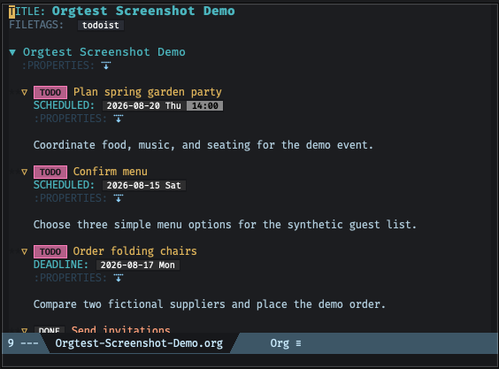
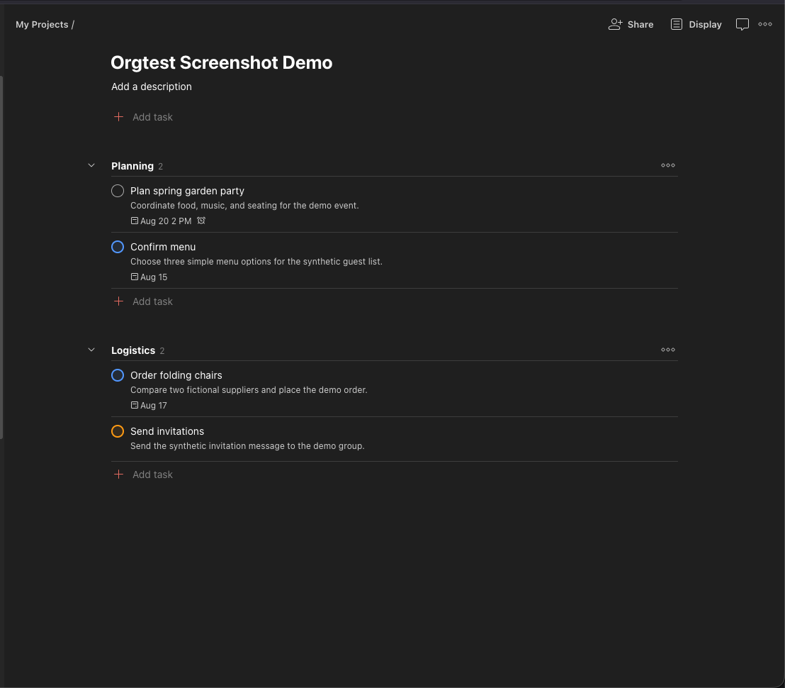
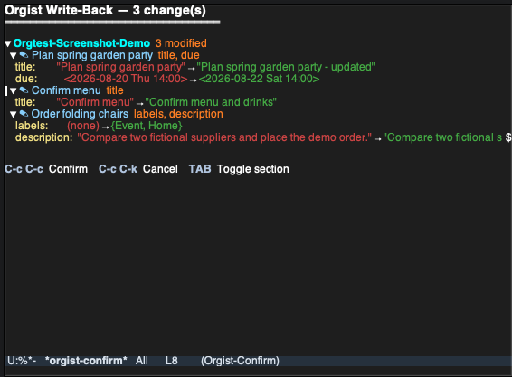

#+TITLE: Orgist

* Overview

Orgist is an Emacs Lisp package for bidirectional synchronization between the
[[https://developer.todoist.com/sync/v9/][Todoist Sync API v1]] and Org-Mode files.

- *Read path* (Todoist \to Org): fully implemented, incremental via sync tokens.
- *Write path* (Org \to Todoist): diff engine and command generation fully complete; runs in dry-run mode by default.

Feature summary:

- One org file per root project, subprojects as headings, sections as headings.
- Tasks with priorities, labels (tags), due dates, deadlines, recurrence,
  titles and descriptions (pandoc markdown \to org, =--wrap=none=),
  duration (time ranges), hierarchy.
- Comments and activity log pulled into logbook entries.
- Collaborator name resolution (=ASSIGNEE= property).
- Reminders: relative (\to DEADLINE warning days), absolute (\to active timestamps),
  location (\to =REMINDER-LOC= property).
- Labels as first-class objects with color-to-face mapping.
- Timezone-aware date conversion using the user profile.
- Quick-add via natural language (=M-x orgist-quick-add=).
- Project-level comments (pre-heading text).
- Subprocess offloading for large syncs (UI stays responsive).
- Rate limit handling (HTTP 429 + retry-after backoff).
- File attachments synced bidirectionally via =org-attach=.
- Offline test suite with cached API responses (180+ tests).

* Screenshots

The following screenshots are real Todoist and Emacs captures using synthetic
=Orgtest= data and contain no personal account information.

#+CAPTION: An actual Org-Mode project buffer managed by Orgist

#+CAPTION: The same synthetic project in the actual Todoist web UI

#+CAPTION: The actual Orgist write-back confirmation buffer with changes expanded

* Configuration

elpaca config:
#+begin_src elisp
  (use-package orgist
    :ensure (:host github :repo "vleonbonnet/orgist")
    ;; Set auth token
    :custom
    (orgist-bearer-token "token or function")
    ;; Sync comments
    (orgist-sync-comments t)
    ;; Sync attachements
    (orgist-sync-attachments t)
    ;; Sync completed tasks
    (orgist-sync-completed-tasks t)
    ;; Sync non-Todoist properties and drawers
    (orgist-sync-metadata t)
    ;; Look for past 10 years
    (orgist-completed-tasks-since-days 3650)
    ;; Add files to agenda
    :config (when (and orgist-base-dir
                       (not (member orgist-base-dir org-agenda-files)))
              (setq org-agenda-files (cons orgist-base-dir org-agenda-files)))
    ;; Enable automatically
    :hook (org-mode . maybe-enable-orgist))
#+end_src

All settings live in the =orgist= customize group.

| Variable                        | Default                      | Purpose                                       |
|---------------------------------+------------------------------+-----------------------------------------------|
| =orgist-bearer-token=             | =nil=                          | Todoist API key (required)                    |
| =orgist-base-dir=                 | =~/.emacs.d/orgist/=           | Directory for org files and state             |
| =orgist-log-level=                | =info=                         | Console log level (=debug=, =info=, =warn=)         |
| =orgist-log-file=                 | =orgist-base-dir/orgist.log=   | Log file path (=nil= to disable)                |
| =orgist-sync-project-filter=      | =nil=                          | Restrict sync to one project by name          |
| =orgist-enable-write-back=        | ='ask=                         | Write-back mode: =nil=, =t=, or ='ask=              |
| =orgist-write-back-dry-run=       | =t=                            | Log write-back commands without API calls     |
| =orgist-read-only=                | =nil=                          | Refuse every remote write; pulls still work   |
| =orgist-treat-priority-4-as-none= | =t=                            | Map Todoist p4 to no org priority             |
| =orgist-sync-on-save=             | =t=                            | Write-back on =C-x C-s= (after-save hook)      |
| =orgist-auto-pull-interval=       | =300=                          | Auto-pull every N seconds (=nil= to disable)    |
| =orgist-sync-comments=            | =nil=                          | Pull comments and activity into logbook       |
| =orgist-sync-attachments=         | =nil=                          | Sync file attachments via =org-attach=          |
| =orgist-async-chunk-size=         | =30=                           | Item count threshold for subprocess sync      |
| =orgist-snapshot-file=            | =orgist-base-dir/snapshots.el= | Persisted snapshot store                      |
| =orgist-tag=                      | ="todoist"=                    | File tag for orgist-managed files             |
| =orgist-history=                  | =t=                            | Record files before and after every sync      |
| =orgist-history-directory=        | =nil= (=.history= in base dir) | History, journal and trash location           |

* Interactive Commands

| Command                   | Purpose                                               |
|---------------------------+-------------------------------------------------------|
| =M-x orgist=               | Write-back + sync (shows confirm buffer in ='ask= mode) |
| =M-x orgist-mode=          | Toggle orgist minor mode in current buffer            |
| =M-x orgist-reset=         | Set orgist's files aside and sync afresh from Todoist  |
| =M-x orgist-history=       | Browse, compare and restore a file's sync history     |
| =M-x orgist-journal=       | Browse text syncs removed; restore an entry          |
| =M-x orgist-write-back=    | Detect local changes and push to Todoist (dry-run)    |
| =M-x orgist-pull-comments= | Manually pull comments and activity for all tasks     |
| =M-x orgist-quick-add=     | Add a task via Todoist's natural language quick-add    |

* Architecture

#+begin_example
Todoist Sync API ──► JSON parse ──► Org-Mode buffers (one file per root project)
       │
  sync_token ──► incremental sync on next call
       │
  resource_types: projects, sections, items,
                  labels, reminders, collaborators,
                  user, user_plan_limits
       │
  snapshot store ──► diff engine ──► Sync API commands (write-back)
#+end_example

** Element Mapping

| Todoist              | Org-Mode                               |
|----------------------+----------------------------------------|
| Root project         | Standalone =.org= file                   |
| Subproject           | Heading in parent file                 |
| Section              | Heading with =SECTION= property          |
| Task / Item          | =* TODO= heading (pandoc markdown \to org) |
| Element ID           | =:ID:=, or =TODOIST_ID= beside an org-id    |
| Priority (1–4)       | =[#A]=, =[#B]=, =[#C]= or none               |
| Labels               | =:tag1:tag2:=                            |
| Due date             | =SCHEDULED:=                             |
| Deadline             | =DEADLINE:=                              |
| Duration             | Time range in SCHEDULED (=13:00-14:00=)  |
| Description          | Body text and non-task child headings    |
| Comments             | Logbook =Note= entries                   |
| Activity (state)     | Logbook state-change entries           |
| Collaborator         | =ASSIGNEE= property (resolved name)     |
| Relative reminder    | DEADLINE warning days (=-2d=)            |
| Absolute reminder    | Active timestamp in body               |
| Location reminder    | =REMINDER-LOC= property                 |
| Project comment      | Pre-heading text (before first =*=)      |
| Child order          | =TODOIST-ORDER= property                 |
| File attachment       | =org-attach= file + =ATTACH= tag             |

** Element Identity

A heading's Todoist ID lives in =:ID:=, which org-id also resolves, so =[[id:...]]= links to synced tasks work.  A heading that already carries an org-id when it is first pushed — stamped by =org-store-link=, capture or org-linker, or an existing heading turned into a task — keeps it: links and ID-derived attachment directories depend on it.  Its Todoist ID goes to =TODOIST_ID= instead, and =TODOIST_ID= takes precedence wherever orgist looks up an element.  Temporary IDs for pending creations also live in =TODOIST_ID=, and move to =:ID:= once Todoist returns the real ID, unless =:ID:= is taken by an org-id.

** Descriptions

A task's description is its body text plus every heading under it that is not a Todoist element: the sub-headings a Markdown description becomes on pull, and notes written in org under the task, travel in the Todoist description as Markdown headings, with levels relative to the task.  Tags and metadata (planning lines, property and logbook drawers) on those headings are org-only and never sent, so an org-id or attachment directory on a description sub-heading is not a change to push.

A pull leaves the body untouched when Todoist's description and absolute reminders are unchanged since the last sync, so those org-only parts survive unrelated remote edits such as a new due date.  When the description did change, the body is rebuilt from Todoist.  A Todoist task written under a description heading is moved up to be a direct child of its task rather than deleted with the description.  Sections have no description in Todoist: their body is never cleared.  Log notes Org writes in the body itself (=org-log-into-drawer= nil) are not description: a pull puts the description below them, and neither write-back nor a rebuilt description touches them.

Snapshots from versions that stopped the description at the first child heading make tasks with sub-headings diff once.  The first write-back after upgrading fetches those tasks' descriptions from Todoist: where the local description is exactly what a pull produces, the snapshot is completed from Todoist and nothing is sent; only descriptions with local edits are pushed.

** Body Spacing

=orgist--normalize-body-spacing= enforces these rules after every element update; normalizing again changes nothing:

- Exactly one blank line between =:END:= (or planning lines) and body content.
- Exactly one blank line between logbook entries and description text.
- Exactly one blank line between body content and the next heading.
- No runs of more than one consecutive blank line outside literal (=#+BEGIN_SRC= etc.) blocks, whose blank lines are never touched.
- Elements with no body content have no trailing blank line.
- Description sub-headings get one blank line around them; the one after a sub-heading goes after its planning line and drawers, which stay attached to it.
- Description sub-headings and their content follow the same rules; child subtrees with an =ID= property (Todoist elements) are normalized by their own updates and skipped by the parent.
- Logbook content means a =:LOGBOOK:= drawer, kept whole, or log notes in the body, recognized from =org-log-note-headings=; it follows the metadata without a blank line.  A bullet-list description is body content and gets its blank line.

Example:

#+begin_example
  ,* TODO Task with description
  :PROPERTIES:
  :ID:  abc123
  :END:
  - State "TODO"  from  [2025-01-01 Wed 12:00]

  Description paragraph here.

  ,* TODO Task without description
  :PROPERTIES:
  :ID:  def456
  :END:
  - State "TODO"  from  [2025-01-01 Wed 12:00]

  ,* TODO Another task
#+end_example

** Key Components

- *API layer*: async HTTP via the =request= library to
  =https://api.todoist.com/api/v1/sync=.  In interactive Emacs, large item
  sets are offloaded to an =emacs --batch= subprocess so the UI stays
  completely responsive (threshold controlled by =orgist-async-chunk-size=).
  The subprocess runs the same sync code path as batch/test mode, writes
  org files and snapshots to disk, then the main Emacs reverts its buffers.
- *Buffer cache*: one Emacs buffer per org file, keyed by project ID in
  =orgist-project-buffer-cache=.
- *ID cache*: buffer-local hash table mapping element IDs to marker positions
  for O(1) lookups.
- *Snapshot system*: after each sync, records Todoist state to
  =~/.emacs.d/orgist/snapshots.el= for write-back diff detection.
- *Timezone handling*: user timezone is fetched from the Todoist =user=
  resource and stored in =orgist-user-timezone=.  UTC timestamps from the
  API are converted to local time via =orgist--convert-timezone=.
- *Rate limiter*: all API calls detect HTTP 429 and retry with exponential
  backoff using the =retry_after= header.

** Sync Resources

The sync request fetches these resource types in a single call:

| Resource            | Usage                                    |
|---------------------+------------------------------------------|
| =projects=            | Root projects and subprojects            |
| =sections=            | Section headings within projects         |
| =items=               | Tasks (the main content)                 |
| =labels=              | Label definitions (ID, name, color)      |
| =reminders=           | Reminder objects grouped by item ID      |
| =collaborators=       | User profiles for assignee resolution    |
| =user=                | Current user (timezone, inbox project)   |
| =user_plan_limits=    | API limits (max projects, collaborators) |

** Write-Back System

The diff engine compares snapshots against the current org buffer state and
generates Todoist Sync API commands:

- =item_update=, =section_update= — content, priority, labels, dates, duration
- =item_delete=, =section_delete=
- =item_complete=, =item_uncomplete= — via checked state
- =item_move= — reparent tasks between sections/projects
- =item_add= — new tasks created locally
- =item_reorder=, =section_reorder= — order changes
- =label_add= — create labels for new tags not yet in Todoist
- =note_add= — push new logbook Notes as Todoist comments
- =attachment_upload= / =attachment_delete= — file attachment sync via REST API

Safety controls:

- *Dry-run mode*: =orgist-write-back-dry-run= (default =t=) logs commands
  without sending them.
- *Three-mode write-back*: =orgist-enable-write-back= controls behavior:
  - =nil= — write-back disabled entirely.
  - =t= — write back without confirmation.
  - ='ask= (default) — show a confirmation buffer before writing.

*** Verification Stamps

The diff scan skips files that have not changed since they were last
verified.  "Verified" is tracked explicitly in =write-back-stamps.el=
(next to =snapshots.el=): each entry maps a project file to the SHA-1
content hash it had when a diff scan of that file last *ran to
completion and its outcome was resolved* — nothing to push, or all
commands confirmed =ok= by the API.  A file is scanned when its
current hash differs from its stamp or its buffer has unsaved
modifications.

The stamp lifecycle is what makes failure handling automatic:

- A scan that errors on an element, a failed API call, or a cancelled
  confirmation buffer leaves the stamp behind — the file re-detects on
  the next save, sync, or auto-pull, so pending changes are never
  silently dropped.
- Files with detected changes are held in =orgist--pending-stamps=
  (with their *scan-time* hash) and committed only after every sync
  command succeeds.  Edits made after the scan produce a different
  hash, so committing scan-time values can never mask them.
- Snapshots are deliberately not involved: any pull may re-persist
  =snapshots.el=, and before stamps existed the mtime comparison
  against it could mask pending local changes within seconds of a
  failed write-back.

One element failing to diff no longer aborts the batch: the error is
logged at warn level, the element is conservatively treated as present
(so the deletion pass cannot emit a spurious =item_delete=), and every
other element and file still processes.

*** Auto-Pull and Pending Changes

Auto-pull (=orgist-auto-pull-interval=) never sends commands or shows
UI, but pulling over unpushed local edits could overwrite them and
refresh their snapshots — losing them permanently.  Before pulling,
auto-pull therefore runs the diff scan (cheap when stamps are current)
and *defers the pull* while local changes are pending, logging once at
info level.  Pushing the changes (save the file, or =M-x orgist=) or
cancelling them resumes pulls on the next tick.

*** Element-Cache Skew Tolerance

Org 9.7's =org-end-of-subtree= trusts the org-element cache for
subtree boundaries; a stale cached boundary (async cache-sync
corruption, observed 2026-08-12) previously crashed the diff scan with
"Invalid search bound" and could feed wrong bounds to subtree surgery.
All subtree-boundary lookups now go through =orgist--subtree-end=,
which validates the returned position (end of buffer, or the start of
a heading line after point) in O(1); on violation it resets the
element cache, recomputes from the fresh parse, and logs a warning —
turning silent corruption into logged self-repair.

*** Confirmation Buffer

When =orgist-enable-write-back= is ='ask=, running =M-x orgist= or
=M-x orgist-write-back= displays the =*orgist-confirm*= buffer, an
[[https://github.com/vleonbonnet/org-sync-confirm][org-sync-confirm]] review of the pending changes grouped by project:

#+begin_example
Orgist Write-Back — 3 changes: 2 modified, 1 new
═════════════════════════════════════════════════

▼ Family  2 modified, 1 new
  ▼ [x] ✎ Renouveler mon passeport  description
      ▶ description:  -1 +1 line, +21 words: est valide jusqu'en mars…
  ▶ [x] + Book photographer  new

C-c C-c  Confirm    C-c C-k  Cancel    TAB  Toggle    S-TAB  Cycle all    RET  Checkbox    n/p  Move
#+end_example

- Short fields show =old → new= inline with the differing words highlighted; long fields show the lines removed and added, the change in word count and an excerpt of the first change, and expand (=TAB=) to a unified diff with word-level refinement.  =S-TAB= cycles the whole buffer.
- The old side of a modified task is its *live* Todoist state, fetched when the buffer opens (up to =orgist-confirm-remote-fetch-limit= tasks); when that state no longer matches the last sync, the task line warns =changed in Todoist since last sync= because confirming overwrites the remote edit.
- Commands that belong to no task (=label_add=) are listed under a =Batch= container and always go with the batch.
- =RET= on a task unticks it.  Unticked changes are not sent: the commands are regenerated for the ticked changes only and the verification stamps are dropped, so the file stays due and the rest is offered again on the next save or sync.
- =C-c C-c= confirms — executes the write-back then continues the sync.
- =C-c C-k= / =q= cancels — aborts the sync cycle; local changes are preserved for the next run.

=orgist-confirm.el= builds the review tree and executes the confirmed
subset; the buffer itself is =org-sync-confirm-mode=.

** Safety Net

Syncs rewrite files you also edit.  Implemented in =org-sync-safety.el=, a library with no knowledge of Todoist, the safety net makes every change a sync makes recorded, explainable and reversible.

- *History.*  Each pull or write-back that changes something leaves two records in a shadow git repository under =orgist-history-directory= (=.history/records=), separate from any repository of yours: the state it started from, which captures your own edits since the previous sync, and its result.  The project files and orgist's state files are recorded; attachments are not.  Without git, content-addressed copies take its place (every copy for two weeks, one a day for a year).  =M-x orgist-history= lists a file's records; =RET= compares one with the current file in ediff, =r= restores it.
- *Journal.*  Text a pull removes is appended verbatim to =.history/journal.org=, with what removed it and why: a task or sub-project deleted in Todoist, a description replaced from Todoist, a stale copy left by a cross-project move, a project file removed.  =M-x orgist-journal-restore= on an entry puts a removed task back under its former parent without its Todoist binding, so the next write-back offers to create it again.
- *Trash.*  Files a sync removes (a deleted project's file, attachments of deleted comments) move to =.history/trash/= instead of being deleted.
- *Guards.*  A task update may only change that task's own subtree; changes made by your Org hooks during the update, such as an org-edna trigger completing the next task, are exempt.  When the pull is done, every element present before must still exist unless Todoist deleted it, no element may appear twice, and no file may lose most of its content.  On a violation, or any error, the project buffers return to their state before the pull (unsaved edits included), nothing is saved, and the sync token is not advanced: the next pull retries from the same point, and the error says what went wrong.
- *Reset.*  =M-x orgist-reset= moves the project files, state, logs and attachments to a dated folder under =.history/= and syncs afresh; nothing is deleted.  It refuses a base directory that is your home, under version control, holds an =.org= file orgist did not create, or has a project buffer with unsaved changes.

** Labels

Label definitions are fetched from the sync API and stored in =orgist-labels=
(hash table: ID \to name/color/order).  On pull, org tag faces are applied based
on each label's Todoist color using =orgist-todoist-color-map= (20 named
colors).  On write-back, adding a tag that doesn't correspond to any existing
label generates a =label_add= command to create it in Todoist.

** Reminders

Todoist reminders are grouped by item ID in =orgist-reminders= and applied
during element update:

| Reminder type | Org representation                                 |
|---------------+----------------------------------------------------|
| Relative      | Warning days on DEADLINE: =DEADLINE: <... -2d>=      |
| Absolute      | Active timestamp in body: =<2026-02-28 Fri 09:00>=   |
| Location      | Property: =REMINDER-LOC: "Office" (37.77, -122.42)= |

** Collaborators

Shared project members are stored in =orgist-collaborators= (hash table:
UID \to name/email).  When a task has a =responsible_uid=, the collaborator's
name is written to the =ASSIGNEE= property.  On write-back, the name is
resolved back to a UID.

** Attachments

File attachments are synced bidirectionally between Todoist comments and
=org-attach= directories.  Requires =orgist-sync-attachments= to be non-nil.

| Todoist                     | Org-Mode                                |
|-----------------------------+-----------------------------------------|
| Comment with =file_attachment= | File in =org-attach= dir + =ATTACH= tag      |

Pull: files from Todoist comment attachments are downloaded into the
heading's =org-attach= directory.  The =ATTACH= tag is added automatically.
Deleted comments remove the corresponding local file.

Push: new files in the =org-attach= directory generate upload + comment
commands.  Removed files generate comment-delete commands.

The =ATTACH= tag is excluded from label sync — it is never sent to Todoist
as a label and never overwritten by label updates.

Attachments on non-TODO child headings (e.g. a =Notes= heading under a
task) are associated with the parent TODO task.

** Project Comments

Todoist project-level comments are fetched via the REST API and inserted as
text in the pre-heading area of the org file (between =#+TITLE:= and the
first =*= heading).  Changes to this text on write-back generate =note_add=
commands with a =project_id= target.

* File Structure

| File              | Purpose                                              |
|-------------------+------------------------------------------------------|
| =orgist.el=         | Main source — all functionality in one file          |
| =orgist-confirm.el= | Write-back review adapter for =org-sync-confirm=      |
| =org-sync-safety.el= | Safety net library: history, journal, trash, guards |
| =README.org=        | This file — project documentation                    |
| =CLAUDE.md=         | Claude Code (AI assistant) instructions              |
| =test-harness.el=   | Offline test infrastructure (request mock, runner)   |
| =test-run.sh=       | Shell wrapper for test-harness and live tests        |
| =test-sync.el=      | Live API pull test script (throwaway base dir)       |
| =test-attachments-live.el= | Live attachment CRUD test (needs token)        |
| =test-writeback-live.el= | Live write-back round trips on Orgtest (needs token) |
| =test-*.el= (others) | Standalone ERT regression suites (=./test-run.sh ert=) |
| =test-isolation.el= | Sandboxes =user-emacs-directory= for every test run |
| =test-data/=        | Shared cached API responses (committed)              |
| =screenshots/=      | Synthetic Org, Todoist, and confirmation views      |

* Testing

** Test Suites

| Mode              | Command                         | Tests | Description                          |
|-------------------+---------------------------------+-------+--------------------------------------|
| Lifecycle (all)   | =./test-run.sh=                   |   ~15 | Full + incremental sync per project  |
| Lifecycle (one)   | =./test-run.sh Orgtest=           |     9 | Single project lifecycle             |
| Formatting        | =./test-run.sh format=            |    95 | Spacing, write-back, new/delete/move |
| Comments          | =./test-run.sh comments=          |    17 | Comment pull, dedup, note push       |
| Subprocess        | =./test-run.sh subprocess=        |    12 | Full + incremental subprocess sync   |
| Cross-project     | =./test-run.sh move=              |    11 | Cross-project task moves             |
| State log         | =./test-run.sh state-log=         |    12 | Completion timestamps, reopen, repeats |
| Archived          | =./test-run.sh archived=          |    21 | Archived sections, order sync        |
| Completed         | =./test-run.sh completed=         |    14 | Completed tasks pull and retry       |
| Metadata          | =./test-run.sh metadata=          |    18 | Non-Todoist property preservation    |
| New features      | =./test-run.sh features=          |   100 | Timezone, duration, labels, etc.     |
| Attachments       | =./test-run.sh attachments=       |    52 | ATTACH tag, pull/push, diff, confirm |
| ERT regression    | =./test-run.sh ert=               |   105 | Identity, ordering, spacing, log notes, guards, review, seams |
| Live write-back   | =./test-run.sh live-writeback=    |    27 | Real API identity, description and safety-net round trips (needs token) |
| Live attachments  | =./test-run.sh live-attachments=  |    19 | Real API attachment CRUD (needs token) |

** Offline Replay (no API token needed)

The primary test path. Uses cached JSON responses with an =advice-add :around=
mock on =request=, running synchronously in batch mode.

#+begin_src bash
  ./test-run.sh                  # All projects (~15 lifecycle tests)
  ./test-run.sh Orgtest          # Single project
#+end_src

Each replay runs a 3-phase lifecycle:
1. Full sync — creates org files from cached =full-sync.json=.
2. Incremental sync — re-syncs using the saved sync token.
3. Diff check — asserts zero spurious diffs after a clean sync.

Runtime artifacts (org files, tokens, snapshots, logs) go to
=/tmp/orgist-test/<Project>/=, outside the repo.

** Recording API Responses

Captures real Todoist API responses and saves them to =test-data/=.
The shared JSON contains all projects; per-project subdirectories are created
only during recording.

#+begin_src bash
  ./test-run.sh record Orgtest   # Needs TODOIST_API_TOKEN or `pass`
#+end_src

** Live API Tests

Runs against the real Todoist API without caching.  The live modes work in a throwaway =orgist-base-dir=, never the mirror directory: =live= only pulls, and =live-writeback= creates its own tasks in the Orgtest project, checks element identity and description sync through pushes and pulls, and deletes the tasks again.

#+begin_src bash
  ./test-run.sh live             # Pull all projects (needs token)
  ./test-run.sh live Orgtest     # Pull a single project (needs token)
  ./test-run.sh live-writeback   # Write-back round trips on Orgtest (needs token, pandoc)
  ORGIST_TEST_TASK_ID=<id> ./test-run.sh live-attachments  # Needs token + disposable task
#+end_src

** Token Resolution

All modes that need an API token check =TODOIST_API_TOKEN= first, then fall
back to =pass show todoist/api-token=.

* TODO items

- [X] Hook save to sync (auto-push on =C-x C-s=) — =orgist-sync-on-save=
- [X] Auto-pull on timer or buffer switch — =orgist-auto-pull-interval=
- [X] Timezone-aware date conversion
- [X] Duration write-back (time ranges)
- [X] Order sync (=item_reorder=, =section_reorder=)
- [X] Expanded sync resources (labels, reminders, collaborators, user)
- [X] Collaborator name resolution (=ASSIGNEE= property)
- [X] Reminders (relative, absolute, location)
- [X] Labels as first-class objects (color faces, =label_add=)
- [X] Quick-add via natural language
- [X] Project-level comments
- [X] Rate limit handling (HTTP 429 + retry-after)
- [X] =note_count= optimization (skip comment fetch when 0)
- [X] File attachment sync (=org-attach= \leftrightarrow Todoist comment attachments)
- [X] Disable =orgist-write-back-dry-run= (enable real write-back — confirmation buffer ready)
- [ ] Conflict resolution for concurrent edits
